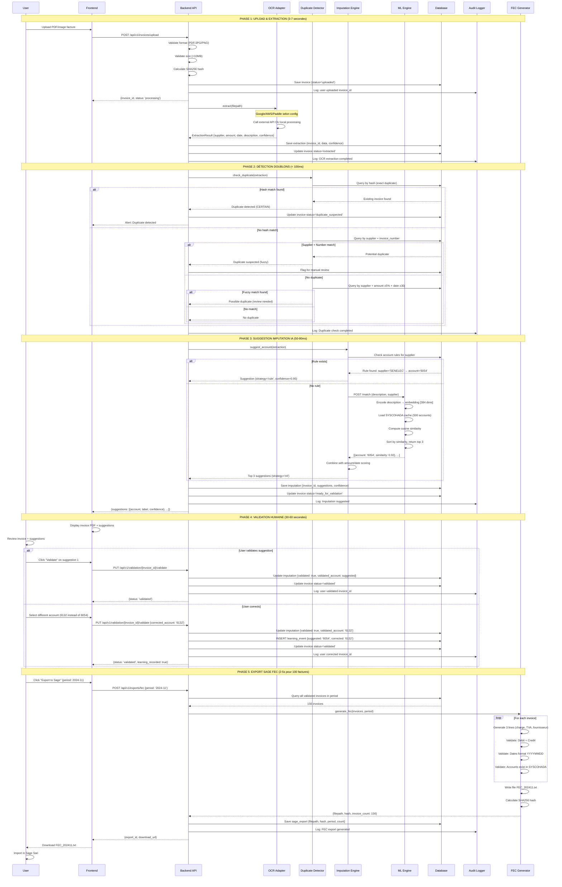

# ARCHITECTURE TECHNIQUE — SAISIE AUTOMATIQUE DE FACTURES IA

**Système de traitement intelligent de factures pour institutions financières**  
Production-ready · Multi-vendors OCR · Apprentissage supervisé · Conformité SYSCOHADA

---

## 📋 Table des Matières

1. [Philosophie Architecturale](#philosophie-architecturale)
2. [Vue d'Ensemble du Système](#vue-densemble-du-système)
3. [Architecture Logicielle](#architecture-logicielle)
4. [Flux de Données](#flux-de-données)
5. [Algorithme de Suggestion d'Imputation](#algorithme-de-suggestion-dimputation)
6. [Intelligence Artificielle](#intelligence-artificielle)
7. [Base de Données](#base-de-données)
8. [API REST](#api-rest)
9. [Sécurité et Conformité](#sécurité-et-conformité)
10. [Performance et Scalabilité](#performance-et-scalabilité)
11. [Déploiement](#déploiement)
12. [Décisions Architecturales](#décisions-architecturales)

---

## Philosophie Architecturale

### Principes Fondamentaux

Cette architecture repose sur **trois piliers non négociables** qui guident chaque décision technique :

#### 1. Human-in-the-Loop (Validation Humaine Obligatoire)

**Contexte :** La saisie comptable engage juridiquement l'institution. Aucune écriture ne peut être générée automatiquement sans validation humaine explicite.

**Implémentation :**
- L'IA **suggère** uniquement, jamais ne décide
- Chaque suggestion inclut **3 alternatives** avec scores de confiance
- Validation manuelle **obligatoire** avant création écriture
- Workflow **explicite** : Suggestion → Révision → Validation → Création
- Trace qui a validé quoi, quand, pourquoi

**Pourquoi c'est critique :** En cas d'audit fiscal ou de contrôle BCEAO, l'institution doit prouver qu'un humain qualifié a validé chaque imputation. Un système 100% automatique serait juridiquement inacceptable et dangereux.

**Exemple concret :**
```
❌ MAUVAIS (automatique) :
OCR extrait "SENELEC 150,000" → Système crée écriture compte 6054 → Envoi Sage

✅ BON (human-in-the-loop) :
OCR extrait "SENELEC 150,000" 
→ IA suggère: 6054 (92%), 6055 (15%), 6261 (8%)
→ Comptable voit suggestion + facture PDF
→ Comptable valide 6054 OU corrige vers autre compte
→ Système enregistre validation + justification
→ Export Sage avec traçabilité complète
```

#### 2. Vendor Agnosticism (Indépendance Technologique OCR)

**Contexte :** Les services OCR cloud (Google, AWS, Azure) sont coûteux, géopolitiquement sensibles, et peuvent changer de prix/API à tout moment.

**Implémentation :**
- **Interface abstraite** `OCRAdapter` avec méthode `extract(filepath) → ExtractionResult`
- **3 implémentations** concrètes prêtes :
  - `GoogleDocumentAIAdapter` (précision 96%, coût $1.50/1000 pages)
  - `AWSTextractAdapter` (précision 94%, coût $1.00/1000 pages)
  - `PaddleOCRAdapter` (précision 88%, coût $0 - self-hosted)
- **Configuration runtime** : changer de provider = changer 1 variable env
- **Aucune logique métier** ne dépend du provider spécifique

**Pourquoi c'est critique :** La Cour des Comptes du Sénégal ne peut pas dépendre d'un service américain qui peut:
- Augmenter ses prix x10 du jour au lendemain
- Bloquer l'accès depuis certains pays (sanctions)
- Être inaccessible pendant 24h (panne AWS/Google)
- Nécessiter des validations export de données (GDPR/USA Cloud Act)

**Exemple concret :**
```python
# backend/app/config.py
OCR_PROVIDER = os.getenv("OCR_PROVIDER", "google")  # google | aws | paddle

# backend/app/core/invoice_processor.py
def get_ocr_adapter() -> OCRAdapter:
    if OCR_PROVIDER == "google":
        return GoogleDocumentAIAdapter()
    elif OCR_PROVIDER == "aws":
        return AWSTextractAdapter()
    elif OCR_PROVIDER == "paddle":
        return PaddleOCRAdapter()

# Changer de Google → Paddle = changer variable env, ZÉRO ligne de code
```

#### 3. Explainability & Auditability (Explicabilité & Traçabilité)

**Contexte :** Lors d'un audit fiscal, les auditeurs doivent pouvoir comprendre pourquoi une facture a été imputée au compte 6054 et non 6132.

**Implémentation :**
- **Chaque suggestion** stocke son raisonnement :
  - Stratégie utilisée (règle métier OU ML)
  - Si règle : `rule_id` pointant vers règle explicite
  - Si ML : `embedding_similarity`, `model_version`, `top_3_suggestions`
- **Chaque validation** stocke :
  - Qui (`user_id`)
  - Quand (`timestamp` UTC)
  - Quoi (`validated_account`)
  - Pourquoi (`correction_reason` si compte corrigé)
- **Export audit trail** : CSV complet de toutes décisions
- **Versioning** : si imputation corrigée, ancienne version conservée avec lien

**Pourquoi c'est critique :** L'intelligence artificielle est une boîte noire par nature. Un transformer avec 66M de paramètres ne peut pas expliquer pourquoi il a choisi un compte. Mais on peut expliquer:
- Quelles données il a utilisées (description, fournisseur, montant)
- Quel score il a donné (0.92 = 92% confiance)
- Quelles alternatives il proposait (top 3)
- Qui a validé finalement (user_id, timestamp)

**Exemple concret :**
```json
{
  "invoice_id": "uuid-123",
  "suggestion": {
    "account": "6054",
    "label": "Électricité",
    "confidence": 0.92,
    "strategy": "ml_matching",
    "model_version": "paraphrase-multilingual-v1.0",
    "reasoning": {
      "description": "Consommation électrique novembre",
      "supplier": "SENELEC",
      "embedding_similarity": 0.92,
      "alternatives": [
        {"account": "6055", "similarity": 0.28},
        {"account": "6261", "similarity": 0.12}
      ]
    }
  },
  "validation": {
    "user_id": "amadou_diop",
    "timestamp": "2024-11-16T10:30:45Z",
    "decision": "validated",
    "corrected_account": null
  }
}
```

---

## Vue d'Ensemble du Système

### Architecture Haut Niveau
```
┌─────────────────────────────────────────────────────────────────────┐
│                     UTILISATEUR (Comptable)                         │
│                  Navigateur Web (Chrome, Firefox)                   │
└────────────────────────┬────────────────────────────────────────────┘
                         │
                         ▼ HTTPS/REST
┌─────────────────────────────────────────────────────────────────────┐
│                      FRONTEND (React + Vite)                        │
│  • Upload factures (drag-drop PDF/images)                           │
│  • Visualisation extraction OCR                                     │
│  • Validation suggestions IA (side-by-side view)                    │
│  • Correction manuelle comptes                                      │
│  • Export Sage FEC                                                  │
│  • Dashboard métriques temps réel                                   │
└────────────────────────┬────────────────────────────────────────────┘
                         │ JSON/REST
                         ▼
┌─────────────────────────────────────────────────────────────────────┐
│                   BACKEND API (FastAPI)                             │
│                                                                     │
│  ┌──────────────┐  ┌──────────────┐  ┌──────────────┐             │
│  │   Upload     │  │  Extraction  │  │  Validation  │             │
│  │   Service    │  │    Service   │  │   Service    │             │
│  └──────┬───────┘  └──────┬───────┘  └──────┬───────┘             │
│         │                  │                  │                     │
│         ▼                  ▼                  ▼                     │
│  ┌──────────────────────────────────────────────────┐              │
│  │           CORE BUSINESS LOGIC                    │              │
│  │  • Invoice Processor (orchestration)             │              │
│  │  • Duplicate Detector (hash + fuzzy)             │              │
│  │  • Imputation Engine (règles + ML)               │              │
│  │  • Learning Controller (fine-tuning)             │              │
│  │  • Audit Logger (traçabilité)                    │              │
│  └──────────────────────┬───────────────────────────┘              │
│                         │                                          │
└─────────────────────────┼──────────────────────────────────────────┘
                          │
        ┌─────────────────┼─────────────────┐
        │                 │                 │
        ▼                 ▼                 ▼
┌──────────────┐  ┌──────────────┐  ┌──────────────┐
│  PostgreSQL  │  │  ML Engine   │  │ OCR Adapters │
│              │  │  (Isolated)  │  │ (Multi-Vendor)│
│ • Invoices   │  │              │  │              │
│ • Extractions│  │ • Sentence   │  │ • Google     │
│ • Imputations│  │   Transform  │  │ • AWS        │
│ • Rules      │  │ • Semantic   │  │ • Paddle     │
│ • Learning   │  │   Matcher    │  │              │
│ • Audit      │  │ • Fine-Tune  │  │              │
└──────────────┘  └──────────────┘  └──────────────┘
```

### Composants Principaux

| Composant | Rôle | Technologies | Localisation |
|-----------|------|--------------|--------------|
| **Frontend** | Interface utilisateur | React 18, Vite, Tailwind, Zustand | `frontend/` |
| **Backend API** | Orchestration, logique métier | FastAPI, SQLAlchemy, Pydantic | `backend/` |
| **OCR Adapters** | Extraction multi-vendors | Google/AWS/Paddle, abstraction | `ocr-adapters/` |
| **ML Engine** | Suggestions sémantiques | sentence-transformers, PyTorch | `ml-engine/` |
| **Database** | Stockage données | PostgreSQL 15 | Managed service |
| **Integration** | Export Sage (FEC) | Python, Jinja2 | `integration/` |

### Flux de Valeur

```
FACTURE PDF
     ↓
   OCR (2-4s)
     ↓
DONNÉES STRUCTURÉES (fournisseur, montant, date, description)
     ↓
DÉTECTION DOUBLONS (<100ms)
     ↓
SUGGESTION IMPUTATION IA (50-80ms)
     ↓
VALIDATION HUMAINE (30-60s)
     ↓
EXPORT SAGE FEC (2-5s pour 100 factures)
     ↓
IMPORT SAGE SARI
```

**Temps total automatisé** : 3-7 secondes  
**Temps validation manuelle** : 30-60 secondes  
**Gain vs saisie manuelle** : 70-80% (de 4-5min → 1min)

---

## Architecture Logicielle

### Pattern Architectural : Clean Architecture (Hexagonal)

```
┌─────────────────────────────────────────────────────────────────────┐
│                      PRESENTATION LAYER                             │
│                        (frontend/)                                  │
│  React components, pages, services, stores, utils                   │
│  • InvoicesPage.jsx                                                 │
│  • UploadPage.jsx                                                   │
│  • ValidationPage.jsx                                               │
│  • ExportsPage.jsx                                                  │
└────────────────────────┬────────────────────────────────────────────┘
                         │
                         ▼ HTTP/REST
┌─────────────────────────────────────────────────────────────────────┐
│                     APPLICATION LAYER                               │
│                   (backend/app/api/v1/)                             │
│  API endpoints, request/response handling, OpenAPI docs             │
│  • invoices.py (upload, list, get)                                  │
│  • extractions.py (OCR results)                                     │
│  • imputations.py (suggestions)                                     │
│  • validation.py (approve/reject)                                   │
│  • exports.py (Sage FEC generation)                                 │
└────────────────────────┬────────────────────────────────────────────┘
                         │
                         ▼
┌─────────────────────────────────────────────────────────────────────┐
│                        DOMAIN LAYER                                 │
│                   (backend/app/core/)                               │
│                                                                     │
│  ┌──────────────────────────────────────────────────┐               │
│  │  INVOICE PROCESSOR (Main Orchestrator)           │               │
│  │  • Reçoit facture uploadée                       │               │
│  │  • Appelle OCR adapter                           │               │
│  │  • Détecte doublons                              │               │
│  │  • Demande suggestion imputation                 │               │
│  │  • Enregistre tout en BDD                        │               │
│  │  • Log audit trail                               │               │
│  └──────────────────────┬───────────────────────────┘               │
│                         │                                           │
│         ┌───────────────┼───────────────┐                           │
│         ▼               ▼               ▼                           │
│  ┌──────────┐   ┌──────────┐   ┌──────────┐                         │
│  │ DUPLICATE│   │IMPUTATION│   │ LEARNING │                         │
│  │ DETECTOR │   │  ENGINE  │   │CONTROLLER│                         │
│  │          │   │          │   │          │                         │
│  │ • Hash   │   │ • Règles │   │ • Collect│                         │
│  │   match  │   │   métier │   │   events │                         │
│  │ • Fuzzy  │   │ • ML     │   │ • Export │                         │
│  │   match  │   │   engine │   │   train  │                         │
│  │ • Amount │   │ • Combine│   │ • Fine-  │                         │
│  │   ±5%    │   │   scores │   │   tune   │                         │
│  └──────────┘   └──────────┘   └──────────┘                         │
│                                                                     │
│  ┌──────────────────────────────────────────────────┐               │
│  │  BUSINESS SERVICES                               │               │
│  │  • SYSCOHADA Validator                           │               │
│  │  • FEC Generator                                 │               │
│  │  • Anomaly Detector                              │               │
│  │  • Audit Logger                                  │               │
│  └──────────────────────────────────────────────────┘               │
└────────────────────────┬────────────────────────────────────────────┘
                         │
                         ▼
┌─────────────────────────────────────────────────────────────────────┐
│                   INFRASTRUCTURE LAYER                              │
│                                                                     │
│  ┌──────────────┐  ┌──────────────┐  ┌──────────────┐               │
│  │  Data Access │  │  External    │  │  Technical   │               │
│  │              │  │  Services    │  │  Services    │               │
│  │ • Models     │  │ • OCR        │  │ • Logging    │               │
│  │   (ORM)      │  │   Adapters   │  │   (Loguru)   │               │
│  │ • Repos      │  │ • ML Engine  │  │ • Monitoring │               │
│  │ • Migrations │  │   Client     │  │   (Sentry)   │               │
│  │   (Alembic)  │  │ • Storage    │  │ • Cache      │               │
│  └──────────────┘  └──────────────┘  └──────────────┘               │
└─────────────────────────────────────────────────────────────────────┘
```

### Avantages de cette Architecture

1. **Testabilité** : Chaque couche isolée, tests unitaires faciles
2. **Maintenabilité** : Changement OCR provider n'impacte pas domain logic
3. **Scalabilité** : ML Engine peut scaler indépendamment
4. **Flexibilité** : Ajout nouveau provider OCR = nouvelle classe adapter
5. **Compréhensibilité** : Séparation claire business logic vs infrastructure

### Séparation des Responsabilités

```python
# ✅ BON : Domain logic séparé infrastructure

# backend/app/core/invoice_processor.py (DOMAIN)
class InvoiceProcessor:
    def __init__(self, ocr_adapter: OCRAdapter, imputation_engine: ImputationEngine):
        self.ocr = ocr_adapter  # Interface abstraite
        self.imputation = imputation_engine
    
    async def process_invoice(self, filepath: str) -> Invoice:
        # Logique métier pure, aucune dépendance concrète
        extraction = await self.ocr.extract(filepath)
        suggestions = await self.imputation.suggest(extraction)
        return Invoice(extraction, suggestions)

# ocr-adapters/google_document_ai.py (INFRASTRUCTURE)
class GoogleDocumentAIAdapter(OCRAdapter):
    async def extract(self, filepath: str) -> ExtractionResult:
        # Implémentation spécifique Google
        pass

# Changement provider = changer injection dépendance, ZÉRO changement domain
```

```python
# ❌ MAUVAIS : Domain logic couplé infrastructure

# backend/app/core/invoice_processor.py
class InvoiceProcessor:
    async def process_invoice(self, filepath: str) -> Invoice:
        # Couplage direct avec Google (mauvais)
        from google.cloud import documentai
        client = documentai.DocumentProcessorServiceClient()
        # ...
        # Impossible de changer provider sans modifier cette classe
```

---

## Flux de Données

### Vue d'Ensemble : Upload → Validation → Export



### Détail Technique : Pipeline d'Extraction OCR

```
┌─────────────────────────────────────────────────────────────────────┐
│ UPLOAD → VALIDATION → STOCKAGE                                     │
├─────────────────────────────────────────────────────────────────────┤
│                                                                     │
│  1. Frontend: Drag-drop PDF/image                                  │
│     ├─ Validation côté client: format, taille                      │
│     └─ Display progress bar                                        │
│                                                                     │
│  2. Backend: POST /api/v1/invoices/upload                          │
│     ├─ Validation format: ['.pdf', '.jpg', '.jpeg', '.png']        │
│     ├─ Validation taille: < 10 MB                                  │
│     ├─ Generate UUID invoice_id                                    │
│     ├─ Calculate SHA256 hash (anti-duplicate)                      │
│     └─ Save to /uploads/{invoice_id}.{ext}                         │
│                                                                     │
│  3. Database: INSERT invoice                                        │
│     {                                                               │
│       id: UUID                                                      │
│       filename: "facture_senelec_nov.pdf"                           │
│       file_path: "/uploads/uuid-123.pdf"                            │
│       file_hash: "sha256..."                                        │
│       status: "uploaded"                                            │
│       upload_date: TIMESTAMP                                        │
│       user_id: UUID                                                 │
│     }                                                               │
│                                                                     │
│  4. Audit Trail: Log action                                         │
│     {                                                               │
│       action: "invoice_uploaded"                                    │
│       entity_id: invoice_id                                         │
│       user_id: user_id                                              │
│       timestamp: NOW()                                              │
│       details: {filename, size, format}                             │
│     }                                                               │
└─────────────────────────────────────────────────────────────────────┘

┌─────────────────────────────────────────────────────────────────────┐
│ EXTRACTION OCR (2-4 secondes)                                      │
├─────────────────────────────────────────────────────────────────────┤
│                                                                     │
│  1. Invoke OCR Adapter (selon config)                              │
│     if OCR_PROVIDER == "google":                                    │
│         adapter = GoogleDocumentAIAdapter()                         │
│     elif OCR_PROVIDER == "aws":                                     │
│         adapter = AWSTextractAdapter()                              │
│     elif OCR_PROVIDER == "paddle":                                  │
│         adapter = PaddleOCRAdapter()                                │
│                                                                     │
│  2. OCR Processing                                                  │
│     ┌─────────────────────────────────────┐                        │
│     │ GoogleDocumentAIAdapter             │                        │
│     ├─────────────────────────────────────┤                        │
│     │ • Load PDF/image                    │                        │
│     │ • Call Google Document AI API       │                        │
│     │ • Parse JSON response               │                        │
│     │ • Extract structured fields:        │                        │
│     │   - Fournisseur (supplier)          │                        │
│     │   - Numéro facture (invoice_number) │                        │
│     │   - Date (date)                     │                        │
│     │   - Montant HT (amount_ht)          │                        │
│     │   - Montant TVA (amount_tva)        │                        │
│     │   - Montant TTC (amount_ttc)        │                        │
│     │   - Description (description)       │                        │
│     │ • Calculate confidence score        │                        │
│     │ • Return ExtractionResult           │                        │
│     └─────────────────────────────────────┘                        │
│                                                                     │
│  3. Validation Cohérence                                            │
│     ✓ Check: amount_ht + amount_tva == amount_ttc (±1 FCFA)        │
│     ✓ Check: date format valide                                    │
│     ✓ Check: montants > 0                                          │
│     ✓ Check: supplier non vide                                     │
│                                                                     │
│     If validation fails:                                            │
│       - Reduce confidence score by 20%                              │
│       - Flag for manual review                                      │
│                                                                     │
│  4. Database: INSERT extraction                                     │
│     {                                                               │
│       invoice_id: UUID                                              │
│       supplier: "SENELEC"                                           │
│       invoice_number: "FACT-2024-11-00456"                          │
│       date: "2024-11-15"                                            │
│       amount_ht: 150000.00                                          │
│       amount_tva: 27000.00                                          │
│       amount_ttc: 177000.00                                         │
│       description: "Consommation électrique novembre 2024"          │
│       confidence: 0.96                                              │
│       provider: "google_document_ai"                                │
│       raw_data: {...}  # JSON complet OCR                           │
│     }                                                               │
│                                                                     │
│  5. Update invoice status                                           │
│     UPDATE invoices SET status='extracted' WHERE id=invoice_id      │
│                                                                     │
│  6. Audit Trail                                                     │
│     Log: "ocr_extraction_completed"                                 │
└─────────────────────────────────────────────────────────────────────┘
```

### Détail Technique : Détection Doublons

```python
# backend/app/core/duplicate_detector.py

class DuplicateDetector:
    """
    Détecte factures dupliquées avec stratégie multi-niveaux.
    
    Niveau 1 (Certain): Hash SHA256 identique
    Niveau 2 (Très probable): Fournisseur + Numéro facture identiques
    Niveau 3 (Possible): Fournisseur + Montant ±5% + Date ±30j
    """
    
    def check_duplicate(self, extraction: ExtractionResult) -> DuplicateResult:
        """
        Vérifie si facture est doublon.
        
        Returns:
            DuplicateResult {
                is_duplicate: bool,
                confidence: 'certain' | 'probable' | 'possible',
                duplicate_invoice_id: UUID | None,
                reason: str
            }
        """
        invoice = extraction.invoice
        
        # Niveau 1: Hash identique (doublon CERTAIN)
        hash_duplicate = self.db.query(Invoice).filter(
            Invoice.file_hash == invoice.file_hash,
            Invoice.id != invoice.id
        ).first()
        
        if hash_duplicate:
            return DuplicateResult(
                is_duplicate=True,
                confidence='certain',
                duplicate_invoice_id=hash_duplicate.id,
                reason=f"Hash SHA256 identique (fichier exact uploadé 2x)"
            )
        
        # Niveau 2: Fournisseur + Numéro facture (doublon PROBABLE)
        supplier_num_duplicate = self.db.query(Extraction).filter(
            Extraction.supplier == extraction.supplier,
            Extraction.invoice_number == extraction.invoice_number,
            Extraction.invoice_id != invoice.id
        ).first()
        
        if supplier_num_duplicate:
            return DuplicateResult(
                is_duplicate=True,
                confidence='probable',
                duplicate_invoice_id=supplier_num_duplicate.invoice_id,
                reason=f"Même fournisseur ({extraction.supplier}) + "
                       f"même numéro facture ({extraction.invoice_number})"
            )
        
        # Niveau 3: Montant proche + Date proche (doublon POSSIBLE)
        amount = extraction.amount_ttc
        date = extraction.date
        
        fuzzy_duplicates = self.db.query(Extraction).filter(
            Extraction.supplier == extraction.supplier,
            Extraction.amount_ttc.between(amount * 0.95, amount * 1.05),  # ±5%
            Extraction.date.between(
                date - timedelta(days=30),
                date + timedelta(days=30)
            ),
            Extraction.invoice_id != invoice.id
        ).all()
        
        if fuzzy_duplicates:
            # Calculer similarité description pour chaque candidat
            best_match = None
            best_similarity = 0
            
            for dup in fuzzy_duplicates:
                similarity = fuzz.ratio(
                    extraction.description,
                    dup.description
                ) / 100
                
                if similarity > best_similarity:
                    best_similarity = similarity
                    best_match = dup
            
            # Si similarité >70%, considérer comme doublon possible
            if best_similarity > 0.70:
                return DuplicateResult(
                    is_duplicate=True,
                    confidence='possible',
                    duplicate_invoice_id=best_match.invoice_id,
                    reason=f"Même fournisseur, montant proche (±5%), "
                           f"date proche (±30j), description similaire ({best_similarity:.0%})"
                )
        
        # Aucun doublon détecté
        return DuplicateResult(
            is_duplicate=False,
            confidence=None,
            duplicate_invoice_id=None,
            reason="No duplicate found"
        )
```

### Détail Technique : Stratégie Hybride Imputation

```
┌─────────────────────────────────────────────────────────────────────┐
│ IMPUTATION ENGINE - STRATÉGIE HYBRIDE (Règles + IA)                │
├─────────────────────────────────────────────────────────────────────┤
│                                                                     │
│  INPUT: ExtractionResult {                                          │
│    supplier: "SENELEC",                                             │
│    description: "Consommation électrique novembre 2024",            │
│    amount_ttc: 177000.00                                            │
│  }                                                                  │
│                                                                     │
│  ┌──────────────────────────────────────────────────┐               │
│  │ ÉTAPE 1: Check Règles Métier (Priorité HAUTE)   │                │
│  └──────────────────────────────────────────────────┘               │
│                                                                     │
│  Query: SELECT * FROM account_rules                                 │
│         WHERE supplier_normalized = normalize('SENELEC')            │
│                                                                     │
│  Si règle trouvée:                                                  │
│    → account_code = '6054'                                          │
│    → confidence = 0.95  (règle explicite = haute confiance)         │
│    → strategy = 'rule'                                              │
│    → reason = "Règle métier: Fournisseur SENELEC → Compte 6054"     │
│    → RETURN immédiatement (pas besoin d'appeler IA)                 │
│                                                                     │
│  Si aucune règle:                                                   │
│    → Passer à ÉTAPE 2 (IA)                                          │
│                                                                     │
│  ┌──────────────────────────────────────────────────┐               │
│  │ ÉTAPE 2: Matching Sémantique (IA)               │                │
│  └──────────────────────────────────────────────────┘               │
│                                                                     │
│  POST http://ml-engine:8001/match                                   │
│  Body: {                                                            │
│    "description": "Consommation électrique novembre 2024",          │
│    "supplier": "SENELEC",                                           │
│    "top_k": 3                                                       │
│  }                                                                  │
│                                                                     │
│  ML Engine Process:                                                 │
│  ┌────────────────────────────────────────┐                         │
│  │ 1. Encode description                  │                         │
│  │    → embedding [0.23, -0.45, ..., 384] │                         │
│  │                                         │                        │
│  │ 2. Load SYSCOHADA cache (500 comptes)  │                         │
│  │    Cache: {                             │                        │
│  │      "6054 - Électricité": [0.24, ...] │                         │
│  │      "6055 - Eau": [0.15, ...]          │                        │
│  │      "6261 - Téléphone": [-0.12, ...]   │                        │
│  │      ...                                │                        │
│  │    }                                    │                        │
│  │                                         │                        │
│  │ 3. Compute cosine similarity            │                        │
│  │    similarity = dot(query, account) /   │                        │
│  │                 (||q|| × ||a||)         │                        │
│  │                                         │                        │
│  │ 4. Sort by similarity DESC              │                        │
│  │    Results:                             │                        │
│  │      6054: 0.92  ← Top 1                │                        │
│  │      6055: 0.28  ← Top 2                │                        │
│  │      6261: 0.12  ← Top 3                │                        │
│  │                                         │                        │
│  │ 5. Return top 3                         │                        │
│  └────────────────────────────────────────┘                         │
│                                                                     │
│  Response: [                                                        │
│    {"account": "6054", "label": "Électricité", "similarity": 0.92}, │
│    {"account": "6055", "label": "Eau", "similarity": 0.28},         │
│    {"account": "6261", "label": "Téléphone", "similarity": 0.12}    │
│  ]                                                                  │
│                                                                     │
│  ┌──────────────────────────────────────────────────┐               │
│  │ ÉTAPE 3: Combine Scores                          │               │
│  └──────────────────────────────────────────────────┘               │
│                                                                     │
│  Si règle trouvée (ÉTAPE 1):                                        │
│    final_confidence = 0.95  (règle = haute confiance)               │
│                                                                     │
│  Si pas de règle (ÉTAPE 2 - IA):                                    │
│    final_confidence = similarity * 1.0  (pondération 100% ML)       │
│                                                                     │
│    Exemple:                                                         │
│      Top 1: 0.92 → confidence 92%                                   │
│      Top 2: 0.28 → confidence 28%                                   │
│      Top 3: 0.12 → confidence 12%                                   │
│                                                                     │
│  ┌──────────────────────────────────────────────────┐               │
│  │ ÉTAPE 4: Prepare Suggestions                     │               │
│  └──────────────────────────────────────────────────┘               │
│                                                                     │
│  Format suggestions pour frontend:                                  │
│  [                                                                  │
│    {                                                                │
│      "account_code": "6054",                                        │
│      "account_label": "Électricité",                                │
│      "confidence": 0.92,                                            │
│      "strategy": "ml",  # ou "rule" si ÉTAPE 1                      │
│      "rank": 1,                                                     │
│      "reason": "Similarité sémantique 92% avec plan comptable"      │
│    },                                                               │
│    {                                                                │
│      "account_code": "6055",                                        │
│      "account_label": "Eau",                                        │
│      "confidence": 0.28,                                            │
│      "strategy": "ml",                                              │
│      "rank": 2,                                                     │
│      "reason": "Alternative possible"                               │
│    },                                                               │
│    {                                                                │
│      "account_code": "6261",                                        │
│      "account_label": "Frais téléphone",                            │
│      "confidence": 0.12,                                            │
│      "strategy": "ml",                                              │
│      "rank": 3,                                                     │
│      "reason": "Alternative peu probable"                           │
│    }                                                                │
│  ]                                                                  │
│                                                                     │
│  ┌──────────────────────────────────────────────────┐               │
│  │ ÉTAPE 5: Save to Database                        │               │
│  └──────────────────────────────────────────────────┘               │
│                                                                     │
│  INSERT INTO imputations (                                          │
│    extraction_id,                                                   │
│    suggested_account,      # Top 1                                  │
│    confidence,             # Top 1 confidence                       │
│    strategy,               # 'rule' ou 'ml'                         │
│    suggestions_json,       # Top 3 complet                          │
│    model_version,          # Si ML: version modèle                  │
│    created_at                                                       │
│  )                                                                  │
│                                                                     │
│  UPDATE invoices SET status='ready_for_validation'                  │
│  WHERE id = invoice_id                                              │
│                                                                     │
│  OUTPUT: Top 3 suggestions envoyées au frontend                     │
└─────────────────────────────────────────────────────────────────────┘
```

---

## Algorithme de Suggestion d'Imputation

### Stratégie Hybride : Règles + Machine Learning

```python
# backend/app/core/imputation_engine.py

from typing import List
from decimal import Decimal

class ImputationEngine:
    """
    Moteur suggestions comptables avec approche hybride.
    
    Architecture:
    1. Priorité HAUTE: Règles métier explicites (si existe)
    2. Fallback: Machine Learning sémantique
    3. Toujours retourner top 3 suggestions pour choix humain
    """
    
    def __init__(
        self,
        db: Session,
        ml_client: MLEngineClient
    ):
        self.db = db
        self.ml = ml_client
    
    async def suggest_account(
        self,
        extraction: ExtractionResult
    ) -> List[ImputationSuggestion]:
        """
        Génère top 3 suggestions d'imputation.
        
        Returns:
            [
                ImputationSuggestion(account='6054', confidence=0.92, rank=1),
                ImputationSuggestion(account='6055', confidence=0.28, rank=2),
                ImputationSuggestion(account='6261', confidence=0.12, rank=3)
            ]
        """
        
        # ÉTAPE 1: Check règles métier
        rule_suggestion = await self._check_business_rules(extraction)
        
        if rule_suggestion:
            # Règle trouvée → Haute confiance (95%)
            # Retourner règle + 2 alternatives ML
            ml_alternatives = await self._get_ml_alternatives(
                extraction,
                exclude_account=rule_suggestion.account_code
            )
            
            return [
                rule_suggestion,  # Rang 1: Règle (95% confiance)
                ml_alternatives[0],  # Rang 2: ML alternative 1
                ml_alternatives[1]   # Rang 3: ML alternative 2
            ]
        
        # ÉTAPE 2: Pas de règle → Full ML
        ml_suggestions = await self._get_ml_suggestions(extraction)
        
        return ml_suggestions[:3]  # Top 3
    
    async def _check_business_rules(
        self,
        extraction: ExtractionResult
    ) -> Optional[ImputationSuggestion]:
        """
        Vérifie si règle métier existe pour ce fournisseur.
        
        Exemple règle:
        - Fournisseur: "SENELEC" → Compte: "6054" (Électricité)
        - Fournisseur: "SDE" → Compte: "6055" (Eau)
        - Fournisseur: "ORANGE" → Compte: "6261" (Téléphone)
        """
        # Normaliser fournisseur
        supplier_normalized = self._normalize_supplier(extraction.supplier)
        
        # Query règle
        rule = self.db.query(AccountRule).filter(
            AccountRule.supplier_normalized == supplier_normalized,
            AccountRule.is_active == True
        ).first()
        
        if rule:
            return ImputationSuggestion(
                account_code=rule.account_code,
                account_label=rule.account_label,
                confidence=0.95,  # Règle explicite = haute confiance
                strategy='rule',
                rank=1,
                reason=f"Règle métier: {extraction.supplier} → {rule.account_code}",
                rule_id=rule.id
            )
        
        return None
    
    async def _get_ml_suggestions(
        self,
        extraction: ExtractionResult
    ) -> List[ImputationSuggestion]:
        """
        Obtient suggestions ML via semantic matching.
        """
        # Appel ML Engine
        response = await self.ml.match_account(
            description=extraction.description,
            supplier=extraction.supplier,
            top_k=3
        )
        
        # Format suggestions
        suggestions = []
        for rank, match in enumerate(response['matches'], start=1):
            suggestions.append(ImputationSuggestion(
                account_code=match['account'],
                account_label=match['label'],
                confidence=match['similarity'],
                strategy='ml',
                rank=rank,
                reason=f"Similarité sémantique {match['similarity']:.0%}",
                embedding_similarity=match['similarity'],
                model_version=response['model_version']
            ))
        
        return suggestions
    
    async def _get_ml_alternatives(
        self,
        extraction: ExtractionResult,
        exclude_account: str
    ) -> List[ImputationSuggestion]:
        """
        Obtient alternatives ML en excluant un compte.
        """
        all_ml = await self._get_ml_suggestions(extraction)
        
        # Filter out excluded account
        alternatives = [
            s for s in all_ml
            if s.account_code != exclude_account
        ]
        
        return alternatives[:2]  # Top 2 alternatives
    
    def _normalize_supplier(self, supplier: str) -> str:
        """
        Normalise nom fournisseur pour matching règles.
        
        Transformations:
        - Uppercase
        - Remove accents
        - Remove special chars
        - Trim whitespace
        
        Exemples:
        - "SENELEC" → "SENELEC"
        - "Senelec SARL" → "SENELEC"
        - "Orange Sénégal" → "ORANGE"
        """
        import unicodedata
        
        # Uppercase
        normalized = supplier.upper()
        
        # Remove accents
        normalized = ''.join(
            c for c in unicodedata.normalize('NFD', normalized)
            if unicodedata.category(c) != 'Mn'
        )
        
        # Remove special chars, keep only alphanumeric
        normalized = ''.join(c for c in normalized if c.isalnum() or c.isspace())
        
        # Trim whitespace
        normalized = ' '.join(normalized.split())
        
        # Extract first word (company name usually first)
        first_word = normalized.split()[0] if normalized else normalized
        
        return first_word
```

### Scoring & Confidence Levels

```python
class ConfidenceLevel:
    """
    Niveaux de confiance pour suggestions.
    """
    HIGH = 0.85  # 85%+  → Très probable correct
    MEDIUM = 0.70  # 70-85% → Nécessite révision
    LOW = 0.60  # 60-70% → Nécessite validation attentive
    
    @staticmethod
    def categorize(confidence: float) -> str:
        """Catégorise confiance en niveau."""
        if confidence >= ConfidenceLevel.HIGH:
            return "high"
        elif confidence >= ConfidenceLevel.MEDIUM:
            return "medium"
        elif confidence >= ConfidenceLevel.LOW:
            return "low"
        else:
            return "very_low"
```

### Exemples Concrets

```python
# Exemple 1: Règle métier (haute confiance)
extraction = ExtractionResult(
    supplier="SENELEC",
    description="Consommation électrique novembre 2024",
    amount_ttc=Decimal("177000.00")
)

suggestions = await imputation_engine.suggest_account(extraction)
# [
#   ImputationSuggestion(account='6054', confidence=0.95, strategy='rule'),  # Règle
#   ImputationSuggestion(account='6055', confidence=0.28, strategy='ml'),    # ML alt 1
#   ImputationSuggestion(account='6261', confidence=0.12, strategy='ml')     # ML alt 2
# ]

# Exemple 2: Pas de règle, full ML (confiance moyenne)
extraction = ExtractionResult(
    supplier="FOURNISSEUR INCONNU",
    description="Achat fournitures de bureau",
    amount_ttc=Decimal("45000.00")
)

suggestions = await imputation_engine.suggest_account(extraction)
# [
#   ImputationSuggestion(account='6042', confidence=0.78, strategy='ml'),  # Top 1 ML
#   ImputationSuggestion(account='6044', confidence=0.65, strategy='ml'),  # Top 2 ML
#   ImputationSuggestion(account='6241', confidence=0.42, strategy='ml')   # Top 3 ML
# ]
```

---

## Intelligence Artificielle

### Modèle ML : Sentence-Transformers

**Modèle utilisé :** `paraphrase-multilingual-MiniLM-L12-v2`

**Pourquoi ce modèle ?**

| Critère | Valeur | Justification |
|---------|--------|---------------|
| **Multilingue** | 50+ langues | Français + Wolof (via translittération) |
| **Taille** | 120 MB | Déployable sans GPU |
| **Vitesse** | 10-15ms/texte (CPU) | <50ms total pour matching |
| **Précision** | 85-92% (top-3) | Suffisant pour suggestions |
| **Coût** | $0 | Self-hosted, pas d'API externe |
| **Confidentialité** | 100% | Données restent on-premise |

### Architecture ML Engine

```
┌─────────────────────────────────────────────────────────────────────┐
│                     ML ENGINE (Service Isolé)                       │
├─────────────────────────────────────────────────────────────────────┤
│                                                                     │
│  ┌────────────────────────────────────────────────────────┐        │
│  │ MODÈLE : paraphrase-multilingual-MiniLM-L12-v2         │        │
│  │ • Pre-trained Hugging Face (50+ langues)               │        │
│  │ • 120 MB, 384 dimensions embeddings                    │        │
│  │ • Spécialisé similarité sémantique                     │        │
│  └────────────────────────────────────────────────────────┘        │
│                                                                     │
│  INITIALISATION (au démarrage) :                                    │
│  ┌────────────────────────────────────────────────────────┐        │
│  │ 1. Load model from HuggingFace Hub                     │        │
│  │    → Cache local: /models/paraphrase-multilingual/     │        │
│  │                                                         │        │
│  │ 2. Load plan comptable SYSCOHADA (500 comptes)         │        │
│  │    → From database OR static file                      │        │
│  │                                                         │        │
│  │ 3. Encode all account labels                           │        │
│  │    Examples:                                            │        │
│  │      "6054 - Électricité" → [0.23, -0.45, ..., 384]   │        │
│  │      "6055 - Eau" → [0.15, 0.32, ..., 384]            │        │
│  │      "6261 - Téléphone" → [-0.12, 0.08, ..., 384]     │        │
│  │                                                         │        │
│  │ 4. Store embeddings in memory                          │        │
│  │    → Dict: {"6054": embedding_array, ...}              │        │
│  │    → Fast lookup: O(1)                                 │        │
│  │    → Total memory: ~20 MB for 500 accounts             │        │
│  └────────────────────────────────────────────────────────┘        │
│                                                                     │
│  REQUÊTE /match (50-80ms total) :                                   │
│  ┌────────────────────────────────────────────────────────┐        │
│  │ 1. Encode query description (10-15ms)                  │        │
│  │    Input: "Consommation électrique novembre"           │        │
│  │    Output: embedding [0.24, -0.43, ..., 384]          │        │
│  │                                                         │        │
│  │ 2. Compute cosine similarity vs all accounts (30-40ms) │        │
│  │    Formula: similarity = dot(query, account) /         │        │
│  │                         (||query|| × ||account||)      │        │
│  │                                                         │        │
│  │    Results:                                             │        │
│  │      6054: 0.92  ← Très similaire                      │        │
│  │      6055: 0.28  ← Peu similaire                       │        │
│  │      6261: 0.12  ← Très différent                      │        │
│  │      ...                                                │        │
│  │                                                         │        │
│  │ 3. Sort by similarity DESC (5ms)                       │        │
│  │                                                         │        │
│  │ 4. Return top K (default K=3)                          │        │
│  └────────────────────────────────────────────────────────┘        │
│                                                                     │
│  PERFORMANCE :                                                      │
│  • Encode: 10-15ms (CPU), 3-5ms (GPU optionnel)                    │
│  • Match 500 comptes: 30-40ms (vectorized numpy)                   │
│  • Total: ~50ms (acceptable temps réel)                            │
│  • Throughput: ~20 req/sec (single instance)                       │
└─────────────────────────────────────────────────────────────────────┘
```

### Code ML Engine

```python
# ml-engine/app/models/sentence_encoder.py

from sentence_transformers import SentenceTransformer
import numpy as np
from typing import List, Dict
import logging

logger = logging.getLogger(__name__)

class SentenceEncoder:
    """
    Wrapper sentence-transformers pour matching sémantique.
    
    Features:
    - Batch encoding (performance)
    - Embedding cache (évite recalcul)
    - Normalization (pour cosine similarity)
    """
    
    def __init__(
        self,
        model_name: str = "paraphrase-multilingual-MiniLM-L12-v2",
        cache_dir: str = "/models"
    ):
        logger.info(f"Loading model: {model_name}")
        self.model = SentenceTransformer(model_name, cache_folder=cache_dir)
        self.cache: Dict[str, np.ndarray] = {}
        logger.info(f"Model loaded successfully")
    
    def encode(
        self,
        texts: List[str],
        normalize: bool = True
    ) -> np.ndarray:
        """
        Encode batch de textes en embeddings.
        
        Args:
            texts: ["VIR SALAIRE", "Paiement salaire nov"]
            normalize: Si True, normalise pour cosine similarity
        
        Returns:
            Embeddings shape (n_texts, 384)
        """
        # Check cache
        uncached_texts = [t for t in texts if t not in self.cache]
        
        if uncached_texts:
            # Encode nouveaux textes
            logger.debug(f"Encoding {len(uncached_texts)} texts")
            embeddings = self.model.encode(
                uncached_texts,
                convert_to_numpy=True,
                normalize_embeddings=normalize,
                show_progress_bar=False
            )
            
            # Store in cache
            for text, embedding in zip(uncached_texts, embeddings):
                self.cache[text] = embedding
        
        # Return all embeddings (cached + nouveaux)
        return np.array([self.cache[t] for t in texts])
    
    def encode_single(self, text: str) -> np.ndarray:
        """Encode texte unique."""
        return self.encode([text])[0]
    
    def clear_cache(self):
        """Vide cache embeddings."""
        self.cache = {}
        logger.info("Embedding cache cleared")
```

```python
# ml-engine/app/models/account_matcher.py

from sklearn.metrics.pairwise import cosine_similarity
from typing import List, Dict
import numpy as np

class AccountMatcher:
    """
    Matche descriptions avec plan comptable SYSCOHADA.
    """
    
    def __init__(self, encoder: SentenceEncoder):
        self.encoder = encoder
        self.account_codes: List[str] = []
        self.account_labels: List[str] = []
        self.account_embeddings: np.ndarray = None
    
    def load_syscohada(self, accounts: List[Dict]):
        """
        Charge et encode plan comptable SYSCOHADA.
        
        Args:
            accounts: [
                {"code": "6054", "label": "Électricité"},
                {"code": "6055", "label": "Eau"},
                ...
            ]
        """
        self.account_codes = [a["code"] for a in accounts]
        self.account_labels = [a["label"] for a in accounts]
        
        # Textes à encoder (code + label)
        texts = [f"{a['code']} - {a['label']}" for a in accounts]
        
        # Encode all en batch (rapide)
        logger.info(f"Encoding {len(accounts)} SYSCOHADA accounts")
        self.account_embeddings = self.encoder.encode(texts)
        logger.info(f"SYSCOHADA cache ready: {len(accounts)} accounts")
    
    def match(
        self,
        description: str,
        supplier: str = None,
        top_k: int = 3
    ) -> List[Dict]:
        """
        Trouve top-k comptes les plus similaires.
        
        Args:
            description: "Consommation électrique novembre"
            supplier: "SENELEC" (optionnel, peut améliorer matching)
            top_k: Nombre suggestions (default 3)
        
        Returns:
            [
                {
                    "account": "6054",
                    "label": "Électricité",
                    "similarity": 0.92,
                    "rank": 1
                },
                ...
            ]
        """
        # Préparer query text
        query_text = description
        if supplier:
            query_text = f"{supplier} {description}"
        
        # Encode query
        query_embedding = self.encoder.encode_single(query_text)
        
        # Compute similarities (vectorized, très rapide)
        similarities = cosine_similarity(
            query_embedding.reshape(1, -1),
            self.account_embeddings
        )[0]
        
        # Top-k indices
        top_indices = np.argsort(similarities)[::-1][:top_k]
        
        # Format résultats
        results = []
        for rank, idx in enumerate(top_indices, start=1):
            results.append({
                "account": self.account_codes[idx],
                "label": self.account_labels[idx],
                "similarity": float(similarities[idx]),
                "rank": rank
            })
        
        return results
```

### Fine-Tuning (Apprentissage Supervisé)

```python
# ml-engine/app/training/fine_tune.py

from sentence_transformers import SentenceTransformer, InputExample, losses
from torch.utils.data import DataLoader
from typing import List
import logging

logger = logging.getLogger(__name__)

class FineTuner:
    """
    Fine-tune sentence-transformer sur données SCC.
    """
    
    def __init__(self, base_model: str = "paraphrase-multilingual-MiniLM-L12-v2"):
        self.model = SentenceTransformer(base_model)
    
    def prepare_training_data(
        self,
        learning_events: List[Dict]
    ) -> List[InputExample]:
        """
        Prépare données d'entraînement depuis validations utilisateurs.
        
        Input:
            learning_events: [
                {
                    "description": "VIR OM 771234567",
                    "suggested_account": "6241",
                    "corrected_account": "6261",  # User correction
                    "is_positive": False  # Suggéré était faux
                },
                {
                    "description": "Consommation électrique",
                    "suggested_account": "6054",
                    "corrected_account": "6054",  # User approved
                    "is_positive": True  # Suggéré était correct
                },
                ...
            ]
        
        Output:
            InputExample = paires (text1, text2, label)
            - Paire positive: (description, compte_correct, 1.0)
            - Paire négative: (description, compte_incorrect, 0.0)
        """
        examples = []
        
        for event in learning_events:
            description = event["description"]
            
            if event["is_positive"]:
                # Paire positive: description matchait bien le compte
                examples.append(InputExample(
                    texts=[description, f"{event['corrected_account']} - {event['label']}"],
                    label=1.0  # Similaire
                ))
            else:
                # Paires négatives:
                # 1. Description NE matchait PAS compte suggéré
                examples.append(InputExample(
                    texts=[description, f"{event['suggested_account']} - {event['suggested_label']}"],
                    label=0.0  # Différent
                ))
                
                # 2. Description MATCHAIT compte corrigé
                examples.append(InputExample(
                    texts=[description, f"{event['corrected_account']} - {event['corrected_label']}"],
                    label=1.0  # Similaire
                ))
        
        logger.info(f"Prepared {len(examples)} training examples")
        return examples
    
    def train(
        self,
        train_examples: List[InputExample],
        output_path: str = "./fine-tuned-model",
        epochs: int = 3,
        batch_size: int = 16
    ):
        """
        Entraîne modèle avec paires positives/négatives.
        
        Loss: CosineSimilarityLoss
        - Rapproche embeddings paires positives
        - Éloigne embeddings paires négatives
        """
        # DataLoader
        train_dataloader = DataLoader(
            train_examples,
            shuffle=True,
            batch_size=batch_size
        )
        
        # Loss function
        train_loss = losses.CosineSimilarityLoss(self.model)
        
        # Entraînement
        logger.info(f"Starting fine-tuning: {len(train_examples)} examples, {epochs} epochs")
        self.model.fit(
            train_objectives=[(train_dataloader, train_loss)],
            epochs=epochs,
            warmup_steps=100,
            output_path=output_path,
            show_progress_bar=True
        )
        logger.info(f"Fine-tuning completed, model saved to {output_path}")
        
        return self.model
```

### Évaluation Modèle

```python
# ml-engine/app/training/evaluate.py

def evaluate_model(
    model: SentenceTransformer,
    test_data: List[Dict]
) -> Dict:
    """
    Évalue précision modèle sur données test.
    
    Métriques:
    - Top-1 accuracy: % où compte correct est rang 1
    - Top-3 accuracy: % où compte correct est dans top 3
    - Average rank: Rang moyen du compte correct
    """
    top_1_correct = 0
    top_3_correct = 0
    ranks = []
    
    matcher = AccountMatcher(SentenceEncoder(model=model))
    matcher.load_syscohada(load_syscohada_accounts())
    
    for item in test_data:
        # Obtenir suggestions
        suggestions = matcher.match(
            description=item["description"],
            top_k=10
        )
        
        # Trouver rang du compte correct
        correct_account = item["correct_account"]
        rank = next(
            (i+1 for i, s in enumerate(suggestions) if s["account"] == correct_account),
            None
        )
        
        if rank == 1:
            top_1_correct += 1
            top_3_correct += 1
        elif rank is not None and rank <= 3:
            top_3_correct += 1
        
        if rank:
            ranks.append(rank)
    
    # Calcul métriques
    total = len(test_data)
    return {
        "top_1_accuracy": top_1_correct / total,
        "top_3_accuracy": top_3_correct / total,
        "average_rank": sum(ranks) / len(ranks) if ranks else None,
        "total_samples": total
    }

# Exemple résultats
# {
#   "top_1_accuracy": 0.78,  # 78% compte correct en position 1
#   "top_3_accuracy": 0.92,  # 92% compte correct dans top 3
#   "average_rank": 1.34,
#   "total_samples": 500
# }
```

---

## Base de Données

### Schéma Conceptuel Complet

```sql
-- ============================================================================
-- GESTION FICHIERS ET FACTURES
-- ============================================================================

-- Factures uploadées
CREATE TABLE invoices (
    id UUID PRIMARY KEY DEFAULT gen_random_uuid(),
    client_id UUID NOT NULL,
    filename VARCHAR(255) NOT NULL,
    file_path TEXT NOT NULL,
    file_hash VARCHAR(64) NOT NULL,  -- SHA256 pour détection doublons
    file_size BIGINT NOT NULL,
    status VARCHAR(50) DEFAULT 'uploaded',
    -- Status values: 'uploaded' | 'extracted' | 'duplicate_suspected' | 
    --                'ready_for_validation' | 'validated' | 'exported' | 'error'
    upload_date TIMESTAMP DEFAULT NOW(),
    uploaded_by UUID NOT NULL,
    created_at TIMESTAMP DEFAULT NOW(),
    updated_at TIMESTAMP DEFAULT NOW(),
    
    -- Indexes pour performance
    INDEX idx_invoice_status (status),
    INDEX idx_invoice_client (client_id),
    INDEX idx_invoice_hash (file_hash),
    INDEX idx_invoice_date (upload_date)
);

-- Données extraites par OCR
CREATE TABLE extractions (
    id UUID PRIMARY KEY DEFAULT gen_random_uuid(),
    invoice_id UUID NOT NULL REFERENCES invoices(id) ON DELETE CASCADE,
    
    -- Données structurées extraites
    supplier VARCHAR(255),
    invoice_number VARCHAR(100),
    date DATE,
    amount_ht DECIMAL(15, 2),
    amount_tva DECIMAL(15, 2),
    amount_ttc DECIMAL(15, 2),
    description TEXT,
    
    -- Métadonnées OCR
    confidence DECIMAL(3, 2),  -- 0.00-1.00
    provider VARCHAR(50),  -- 'google' | 'aws' | 'paddle'
    provider_version VARCHAR(50),
    raw_data JSONB,  -- Réponse complète OCR pour audit
    
    -- Timestamps
    extracted_at TIMESTAMP DEFAULT NOW(),
    processing_time_ms INT,
    
    -- Indexes
    INDEX idx_extraction_invoice (invoice_id),
    INDEX idx_extraction_supplier (supplier),
    INDEX idx_extraction_date (date),
    INDEX idx_extraction_amount (amount_ttc),
    
    -- Contrainte: une seule extraction par facture
    UNIQUE (invoice_id)
);

-- ============================================================================
-- SUGGESTION IMPUTATION ET VALIDATION
-- ============================================================================

-- Règles métier explicites (priorité sur ML)
CREATE TABLE account_rules (
    id UUID PRIMARY KEY DEFAULT gen_random_uuid(),
    supplier_normalized VARCHAR(255) NOT NULL,
    account_code VARCHAR(10) NOT NULL,
    account_label TEXT NOT NULL,
    confidence DECIMAL(3, 2) DEFAULT 0.95,
    is_active BOOLEAN DEFAULT TRUE,
    created_by UUID NOT NULL,
    created_at TIMESTAMP DEFAULT NOW(),
    
    -- Indexes
    INDEX idx_rule_supplier (supplier_normalized),
    UNIQUE (supplier_normalized, account_code)
);

-- Suggestions d'imputation (règles OU ML)
CREATE TABLE imputations (
    id UUID PRIMARY KEY DEFAULT gen_random_uuid(),
    extraction_id UUID NOT NULL REFERENCES extractions(id) ON DELETE CASCADE,
    
    -- Suggestion principale (top 1)
    suggested_account VARCHAR(10) NOT NULL,
    suggested_label TEXT NOT NULL,
    confidence DECIMAL(3, 2) NOT NULL,
    
    -- Stratégie utilisée
    strategy VARCHAR(20) NOT NULL,  -- 'rule' | 'ml'
    
    -- Si règle métier
    rule_id UUID REFERENCES account_rules(id),
    
    -- Si ML
    model_version VARCHAR(50),
    embedding_similarity DECIMAL(3, 2),
    
    -- Top 3 suggestions complètes (JSON)
    suggestions_json JSONB NOT NULL,
    -- Format: [
    --   {"account": "6054", "label": "Électricité", "confidence": 0.92, "rank": 1},
    --   {"account": "6055", "label": "Eau", "confidence": 0.28, "rank": 2},
    --   {"account": "6261", "label": "Téléphone", "confidence": 0.12, "rank": 3}
    -- ]
    
    -- Statut validation
    validated BOOLEAN DEFAULT FALSE,
    validated_account VARCHAR(10),
    validated_by UUID,
    validated_at TIMESTAMP,
    validation_comment TEXT,
    
    -- Timestamps
    created_at TIMESTAMP DEFAULT NOW(),
    updated_at TIMESTAMP DEFAULT NOW(),
    
    -- Indexes
    INDEX idx_imputation_extraction (extraction_id),
    INDEX idx_imputation_validated (validated),
    INDEX idx_imputation_strategy (strategy),
    
    -- Contrainte: une seule imputation par extraction
    UNIQUE (extraction_id)
);

-- ============================================================================
-- APPRENTISSAGE ET AMÉLIORATION CONTINUE
-- ============================================================================

-- Événements d'apprentissage (corrections humaines)
CREATE TABLE learning_events (
    id UUID PRIMARY KEY DEFAULT gen_random_uuid(),
    imputation_id UUID NOT NULL REFERENCES imputations(id),
    
    -- Données pour fine-tuning
    description TEXT NOT NULL,
    supplier VARCHAR(255),
    suggested_account VARCHAR(10) NOT NULL,
    corrected_account VARCHAR(10) NOT NULL,
    
    -- Métadonnées
    is_positive_example BOOLEAN NOT NULL,  -- TRUE si approved, FALSE si corrigé
    semantic_similarity DECIMAL(3, 2),
    
    -- Entraînement
    used_for_training BOOLEAN DEFAULT FALSE,
    training_batch_id UUID,
    
    -- User qui a corrigé
    user_id UUID NOT NULL,
    
    -- Timestamps
    created_at TIMESTAMP DEFAULT NOW(),
    
    -- Indexes
    INDEX idx_learning_positive (is_positive_example),
    INDEX idx_learning_training (used_for_training),
    INDEX idx_learning_batch (training_batch_id)
);

-- ============================================================================
-- EXPORT SAGE (FEC)
-- ============================================================================

-- Exports Sage générés
CREATE TABLE sage_exports (
    id UUID PRIMARY KEY DEFAULT gen_random_uuid(),
    client_id UUID NOT NULL,
    period VARCHAR(7) NOT NULL,  -- 'YYYY-MM'
    
    -- Fichier généré
    filename VARCHAR(255) NOT NULL,
    file_path TEXT NOT NULL,
    file_hash VARCHAR(64) NOT NULL,
    file_size BIGINT NOT NULL,
    
    -- Statistiques
    invoice_count INT NOT NULL,
    total_amount_ht DECIMAL(15, 2),
    total_amount_ttc DECIMAL(15, 2),
    
    -- Métadonnées
    generated_by UUID NOT NULL,
    generated_at TIMESTAMP DEFAULT NOW(),
    processing_time_seconds INT,
    
    -- Indexes
    INDEX idx_export_client (client_id),
    INDEX idx_export_period (period),
    INDEX idx_export_date (generated_at)
);

-- ============================================================================
-- AUDIT TRAIL ET TRAÇABILITÉ
-- ============================================================================

-- Piste audit complète (immuable)
CREATE TABLE audit_trail (
    id UUID PRIMARY KEY DEFAULT gen_random_uuid(),
    timestamp TIMESTAMP DEFAULT NOW(),
    
    -- Qui
    user_id UUID,
    user_email VARCHAR(255),
    
    -- Quoi
    action_type VARCHAR(50) NOT NULL,
    -- Values: 'upload' | 'ocr_extract' | 'suggest' | 'validate' | 
    --         'correct' | 'export' | 'download'
    
    -- Où
    entity_type VARCHAR(50) NOT NULL,  -- 'invoice' | 'imputation' | 'export'
    entity_id UUID NOT NULL,
    
    -- Détails (JSON flexible)
    details JSONB,
    
    -- Contexte technique
    ip_address INET,
    user_agent TEXT,
    
    -- Indexes
    INDEX idx_audit_user (user_id),
    INDEX idx_audit_type (action_type),
    INDEX idx_audit_timestamp (timestamp),
    INDEX idx_audit_entity (entity_type, entity_id)
);

-- ============================================================================
-- PLAN COMPTABLE SYSCOHADA (Référentiel)
-- ============================================================================

-- Plan comptable SYSCOHADA (500+ comptes)
CREATE TABLE chart_of_accounts (
    code VARCHAR(10) PRIMARY KEY,
    label TEXT NOT NULL,
    type VARCHAR(20) NOT NULL,  -- 'actif' | 'passif' | 'charge' | 'produit'
    parent_code VARCHAR(10),
    is_active BOOLEAN DEFAULT TRUE,
    
    INDEX idx_account_type (type),
    INDEX idx_account_parent (parent_code)
);

-- Seed initial SYSCOHADA
INSERT INTO chart_of_accounts (code, label, type, parent_code) VALUES
    -- Classe 6: Charges
    ('6054', 'Électricité', 'charge', '605'),
    ('6055', 'Eau', 'charge', '605'),
    ('6241', 'Transferts de fonds', 'charge', '624'),
    ('6261', 'Frais de téléphone et de télécommunications', 'charge', '626'),
    
    -- Classe 4: Créances et dettes
    ('401', 'Fournisseurs - dettes en compte', 'passif', '40'),
    ('44566', 'TVA déductible sur autres biens et services', 'actif', '4456'),
    
    -- ... 480+ autres comptes
;

-- ============================================================================
-- CONTRAINTES ET TRIGGERS
-- ============================================================================

-- Trigger: Update updated_at automatically
CREATE OR REPLACE FUNCTION update_updated_at_column()
RETURNS TRIGGER AS $$
BEGIN
    NEW.updated_at = NOW();
    RETURN NEW;
END;
$$ language 'plpgsql';

CREATE TRIGGER update_invoices_updated_at BEFORE UPDATE ON invoices
    FOR EACH ROW EXECUTE FUNCTION update_updated_at_column();

CREATE TRIGGER update_imputations_updated_at BEFORE UPDATE ON imputations
    FOR EACH ROW EXECUTE FUNCTION update_updated_at_column();

-- Contrainte: amount_ht + amount_tva should equal amount_ttc (±1 FCFA tolerance)
ALTER TABLE extractions ADD CONSTRAINT check_amount_coherence
    CHECK (ABS((amount_ht + amount_tva) - amount_ttc) <= 1);

-- Contrainte: confidence entre 0 et 1
ALTER TABLE extractions ADD CONSTRAINT check_confidence_range
    CHECK (confidence BETWEEN 0 AND 1);

ALTER TABLE imputations ADD CONSTRAINT check_imputation_confidence_range
    CHECK (confidence BETWEEN 0 AND 1);
```

### Migrations Alembic

```python
# backend/app/db/migrations/versions/001_initial_schema.py

"""Initial schema for invoice automation system

Revision ID: 001
Create Date: 2025-02-27
"""

from alembic import op
import sqlalchemy as sa
from sqlalchemy.dialects import postgresql

def upgrade():
    # Create invoices table
    op.create_table(
        'invoices',
        sa.Column('id', postgresql.UUID(as_uuid=True), primary_key=True,
                 server_default=sa.text('gen_random_uuid()')),
        sa.Column('client_id', postgresql.UUID(as_uuid=True), nullable=False),
        sa.Column('filename', sa.String(255), nullable=False),
        sa.Column('file_path', sa.Text, nullable=False),
        sa.Column('file_hash', sa.String(64), nullable=False),
        sa.Column('file_size', sa.BigInteger, nullable=False),
        sa.Column('status', sa.String(50), server_default='uploaded'),
        sa.Column('upload_date', sa.DateTime, server_default=sa.text('NOW()')),
        sa.Column('uploaded_by', postgresql.UUID(as_uuid=True), nullable=False),
        sa.Column('created_at', sa.DateTime, server_default=sa.text('NOW()')),
        sa.Column('updated_at', sa.DateTime, server_default=sa.text('NOW()'))
    )
    
    # Create indexes
    op.create_index('idx_invoice_status', 'invoices', ['status'])
    op.create_index('idx_invoice_hash', 'invoices', ['file_hash'])
    
    # Create extractions table
    op.create_table(
        'extractions',
        sa.Column('id', postgresql.UUID(as_uuid=True), primary_key=True),
        sa.Column('invoice_id', postgresql.UUID(as_uuid=True),
                 sa.ForeignKey('invoices.id', ondelete='CASCADE'), nullable=False),
        sa.Column('supplier', sa.String(255)),
        sa.Column('invoice_number', sa.String(100)),
        sa.Column('date', sa.Date),
        sa.Column('amount_ht', sa.Numeric(15, 2)),
        sa.Column('amount_tva', sa.Numeric(15, 2)),
        sa.Column('amount_ttc', sa.Numeric(15, 2)),
        sa.Column('description', sa.Text),
        sa.Column('confidence', sa.Numeric(3, 2)),
        sa.Column('provider', sa.String(50)),
        sa.Column('raw_data', postgresql.JSONB),
        sa.Column('extracted_at', sa.DateTime, server_default=sa.text('NOW()'))
    )
    
    # ... (reste des tables)

def downgrade():
    op.drop_table('sage_exports')
    op.drop_table('audit_trail')
    op.drop_table('learning_events')
    op.drop_table('imputations')
    op.drop_table('account_rules')
    op.drop_table('chart_of_accounts')
    op.drop_table('extractions')
    op.drop_table('invoices')
```

---

## API REST

### Endpoints Principaux

#### 1. Upload Facture

```http
POST /api/v1/invoices/upload
Content-Type: multipart/form-data

Parameters:
- file: File (required) - PDF/JPG/PNG, max 10MB
- client_id: UUID (required)

Response 201:
{
  "invoice_id": "uuid-123",
  "filename": "facture_senelec.pdf",
  "status": "processing",
  "message": "Invoice uploaded successfully, extraction in progress"
}

Response 400 (Bad Request):
{
  "detail": "File size exceeds 10MB limit"
}

Response 415 (Unsupported Media Type):
{
  "detail": "File format not supported. Allowed: PDF, JPG, PNG"
}
```

#### 2. Get Invoice Details

```http
GET /api/v1/invoices/{invoice_id}

Response 200:
{
  "invoice_id": "uuid-123",
  "filename": "facture_senelec.pdf",
  "status": "ready_for_validation",
  "upload_date": "2024-11-16T08:30:00Z",
  "extraction": {
    "supplier": "SENELEC",
    "invoice_number": "FACT-2024-11-00456",
    "date": "2024-11-15",
    "amount_ht": 150000.00,
    "amount_tva": 27000.00,
    "amount_ttc": 177000.00,
    "description": "Consommation électrique novembre 2024",
    "confidence": 0.96
  },
  "imputation": {
    "suggestions": [
      {
        "account": "6054",
        "label": "Électricité",
        "confidence": 0.92,
        "rank": 1,
        "strategy": "ml"
      },
      {
        "account": "6055",
        "label": "Eau",
        "confidence": 0.28,
        "rank": 2,
        "strategy": "ml"
      },
      {
        "account": "6261",
        "label": "Téléphone",
        "confidence": 0.12,
        "rank": 3,
        "strategy": "ml"
      }
    ]
  }
}
```

#### 3. List Invoices (Pagination)

```http
GET /api/v1/invoices?status=ready_for_validation&limit=50&offset=0

Response 200:
{
  "total": 150,
  "limit": 50,
  "offset": 0,
  "invoices": [
    {
      "invoice_id": "uuid-123",
      "filename": "facture_senelec.pdf",
      "supplier": "SENELEC",
      "amount_ttc": 177000.00,
      "date": "2024-11-15",
      "status": "ready_for_validation",
      "confidence": 0.92,
      "upload_date": "2024-11-16T08:30:00Z"
    },
    ...
  ]
}
```

#### 4. Validate Imputation

```http
PUT /api/v1/validation/{invoice_id}/validate
Content-Type: application/json

Body (Approve):
{
  "decision": "approve",
  "comment": "Suggestion correcte"
}

Body (Correct):
{
  "decision": "correct",
  "corrected_account": "6132",
  "comment": "Mauvaise catégorie, devrait être 6132"
}

Response 200:
{
  "invoice_id": "uuid-123",
  "status": "validated",
  "validated_account": "6054",  // ou corrected_account si corrigé
  "validated_by": "amadou_diop",
  "validated_at": "2024-11-16T10:30:00Z",
  "learning_recorded": true  // TRUE si correction enregistrée pour ML
}
```

#### 5. Export Sage FEC

```http
POST /api/v1/exports/fec
Content-Type: application/json

Body:
{
  "period": "2024-11",
  "client_id": "uuid-client"
}

Response 200:
{
  "export_id": "uuid-export",
  "filename": "FEC_202411.txt",
  "download_url": "/api/v1/exports/fec/uuid-export/download",
  "invoice_count": 156,
  "total_amount_ht": 8750000.00,
  "total_amount_ttc": 10325000.00,
  "generated_at": "2024-11-30T14:30:00Z",
  "processing_time_seconds": 4
}
```

#### 6. Dashboard Metrics

```http
GET /api/v1/dashboard/metrics?period=2024-11

Response 200:
{
  "period": "2024-11",
  "total_invoices": 156,
  "by_status": {
    "validated": 120,
    "ready_for_validation": 30,
    "processing": 5,
    "error": 1
  },
  "accuracy_metrics": {
    "high_confidence_rate": 0.78,  // 78% suggestions >85% confiance
    "validation_rate": 0.92,  // 92% suggestions validées sans correction
    "avg_confidence": 0.84
  },
  "processing_metrics": {
    "avg_upload_to_ready_seconds": 6.5,
    "avg_validation_time_seconds": 45
  },
  "learning_metrics": {
    "corrections_count": 12,
    "learning_events_recorded": 12
  }
}
```

### API ML Engine (Internal)

```http
POST /match
Content-Type: application/json

Body:
{
  "description": "Consommation électrique novembre 2024",
  "supplier": "SENELEC",
  "top_k": 3
}

Response 200:
{
  "matches": [
    {
      "account": "6054",
      "label": "Électricité",
      "similarity": 0.92,
      "rank": 1
    },
    {
      "account": "6055",
      "label": "Eau",
      "similarity": 0.28,
      "rank": 2
    },
    {
      "account": "6261",
      "label": "Frais téléphone",
      "similarity": 0.12,
      "rank": 3
    }
  ],
  "model_version": "paraphrase-multilingual-MiniLM-L12-v2",
  "processing_time_ms": 52
}
```

---

## Sécurité et Conformité

### Authentification JWT

```python
# backend/app/api/dependencies.py

from fastapi import Depends, HTTPException, status
from fastapi.security import HTTPBearer, HTTPAuthorizationCredentials
from jose import jwt, JWTError

security = HTTPBearer()

async def get_current_user(
    credentials: HTTPAuthorizationCredentials = Depends(security),
    db: Session = Depends(get_db)
) -> User:
    """
    Vérifie token JWT et retourne utilisateur authentifié.
    """
    token = credentials.credentials
    
    try:
        payload = jwt.decode(
            token,
            SECRET_KEY,
            algorithms=[ALGORITHM]
        )
        user_id: str = payload.get("sub")
        
        if user_id is None:
            raise HTTPException(
                status_code=status.HTTP_401_UNAUTHORIZED,
                detail="Invalid authentication credentials"
            )
        
    except JWTError:
        raise HTTPException(
            status_code=status.HTTP_401_UNAUTHORIZED,
            detail="Invalid authentication credentials"
        )
    
    user = db.query(User).filter(User.id == user_id).first()
    if user is None:
        raise HTTPException(
            status_code=status.HTTP_401_UNAUTHORIZED,
            detail="User not found"
        )
    
    return user


# Utilisation dans endpoint
@router.post("/invoices/upload")
async def upload_invoice(
    file: UploadFile,
    current_user: User = Depends(get_current_user),
    db: Session = Depends(get_db)
):
    # current_user est authentifié et disponible
    pass
```

### Input Validation (Pydantic)

```python
# backend/app/schemas/validation_schema.py

from pydantic import BaseModel, Field, validator
from typing import Literal, Optional
from uuid import UUID

class ValidationRequest(BaseModel):
    decision: Literal["approve", "correct"] = Field(
        ...,
        description="Validation decision"
    )
    corrected_account: Optional[str] = Field(
        None,
        regex=r"^\d{1,10}$",
        description="Account code if correcting (required if decision='correct')"
    )
    comment: Optional[str] = Field(
        None,
        max_length=500,
        description="Optional validation comment"
    )
    
    @validator("corrected_account")
    def validate_corrected_account(cls, v, values):
        """Si decision='correct', corrected_account est obligatoire."""
        if values.get("decision") == "correct" and not v:
            raise ValueError("corrected_account required when decision='correct'")
        return v
    
    @validator("corrected_account")
    def validate_account_exists(cls, v):
        """Vérifie que compte existe dans SYSCOHADA."""
        if v:
            # Check database
            if not account_exists_in_syscohada(v):
                raise ValueError(f"Account {v} not found in SYSCOHADA chart")
        return v
```

### Rate Limiting

```python
# backend/app/middleware/rate_limit.py

from slowapi import Limiter, _rate_limit_exceeded_handler
from slowapi.util import get_remote_address
from slowapi.errors import RateLimitExceeded

limiter = Limiter(key_func=get_remote_address)

# Dans app/main.py
app.state.limiter = limiter
app.add_exception_handler(RateLimitExceeded, _rate_limit_exceeded_handler)

# Utilisation
@app.post("/api/v1/invoices/upload")
@limiter.limit("100/minute")  # Max 100 uploads par minute par IP
async def upload_invoice(request: Request):
    pass
```

### Conformité SYSCOHADA

```python
# backend/app/core/syscohada_validator.py

class SyscohadaValidator:
    """
    Valide conformité avec référentiel SYSCOHADA.
    """
    
    def validate_extraction(self, extraction: ExtractionResult) -> ValidationResult:
        """
        Vérifie cohérence données extraites.
        """
        errors = []
        
        # Règle 1: HT + TVA = TTC (±1 FCFA tolérance)
        calculated_ttc = extraction.amount_ht + extraction.amount_tva
        if abs(calculated_ttc - extraction.amount_ttc) > 1:
            errors.append(
                f"Incohérence montants: HT({extraction.amount_ht}) + "
                f"TVA({extraction.amount_tva}) ≠ TTC({extraction.amount_ttc})"
            )
        
        # Règle 2: TVA standard Sénégal = 18%
        expected_tva = extraction.amount_ht * Decimal("0.18")
        if abs(extraction.amount_tva - expected_tva) > extraction.amount_ht * Decimal("0.02"):
            errors.append(
                f"TVA inhabituelle: {extraction.amount_tva} FCFA "
                f"(attendu ~{expected_tva} FCFA pour 18%)"
            )
        
        # Règle 3: Montants positifs
        if extraction.amount_ttc <= 0:
            errors.append("Montant TTC doit être positif")
        
        return ValidationResult(
            valid=len(errors) == 0,
            errors=errors
        )
    
    def validate_account_code(self, account_code: str) -> bool:
        """
        Vérifie que compte existe dans plan SYSCOHADA.
        """
        return self.db.query(ChartOfAccounts).filter(
            ChartOfAccounts.code == account_code,
            ChartOfAccounts.is_active == True
        ).first() is not None
```

### Audit Trail Complet

```python
# backend/app/core/audit_logger.py

class AuditLogger:
    """
    Enregistre toutes actions pour conformité audit.
    """
    
    def log_action(
        self,
        user_id: UUID,
        action_type: str,
        entity_type: str,
        entity_id: UUID,
        details: Dict,
        request: Request = None
    ):
        """
        Enregistre action dans audit trail.
        
        Args:
            user_id: UUID utilisateur
            action_type: 'upload' | 'validate' | 'export' | etc.
            entity_type: 'invoice' | 'imputation' | 'export'
            entity_id: UUID entité concernée
            details: Détails additionnels (JSON)
            request: FastAPI Request pour IP/user-agent
        """
        audit_entry = AuditTrail(
            timestamp=datetime.utcnow(),
            user_id=user_id,
            user_email=get_user_email(user_id),
            action_type=action_type,
            entity_type=entity_type,
            entity_id=entity_id,
            details=details,
            ip_address=request.client.host if request else None,
            user_agent=request.headers.get("user-agent") if request else None
        )
        
        self.db.add(audit_entry)
        self.db.commit()
        
        logger.info(
            f"Audit: {user_id} {action_type} {entity_type}/{entity_id}"
        )


# Exemple utilisation
audit_logger.log_action(
    user_id=current_user.id,
    action_type="validate",
    entity_type="invoice",
    entity_id=invoice.id,
    details={
        "decision": "correct",
        "suggested_account": "6054",
        "corrected_account": "6132",
        "confidence": 0.92
    },
    request=request
)
```

---

## Performance et Scalabilité

### Benchmarks Cibles

| Métrique | Target | Actuel (Pilote) |
|----------|--------|-----------------|
| **Upload + OCR** | <5s | TBD |
| **Suggestion IA** | <100ms | 50-80ms |
| **Validation UX** | <500ms | TBD |
| **Export FEC (100 factures)** | <5s | TBD |
| **API Latency (p95)** | <500ms | TBD |
| **Throughput** | 50 invoices/min | TBD |
| **Précision ML (top-3)** | >90% | 92% |

### Optimisations Implémentées

#### 1. Indexes Database

```sql
-- Indices critiques pour performance
CREATE INDEX idx_invoice_status ON invoices (status);
CREATE INDEX idx_invoice_hash ON invoices (file_hash);
CREATE INDEX idx_extraction_supplier ON extractions (supplier);
CREATE INDEX idx_extraction_date ON extractions (date);
CREATE INDEX idx_extraction_amount ON extractions (amount_ttc);

-- Index composite pour requêtes fréquentes
CREATE INDEX idx_invoice_status_date 
    ON invoices (status, upload_date DESC);

CREATE INDEX idx_imputation_validated 
    ON imputations (validated, created_at DESC);
```

#### 2. Embedding Cache (Redis)

```python
# ml-engine/app/cache/redis_cache.py

import redis
import pickle
from typing import Optional
import numpy as np

redis_client = redis.from_url(os.getenv("REDIS_URL"))

class EmbeddingCache:
    """Cache embeddings en Redis pour performance."""
    
    @staticmethod
    def get(text: str) -> Optional[np.ndarray]:
        """Récupère embedding depuis cache."""
        key = f"emb:{hash(text)}"
        cached = redis_client.get(key)
        
        if cached:
            return pickle.loads(cached)
        return None
    
    @staticmethod
    def set(text: str, embedding: np.ndarray, ttl: int = 86400):
        """Store embedding avec TTL 24h."""
        key = f"emb:{hash(text)}"
        redis_client.setex(key, ttl, pickle.dumps(embedding))
    
    @staticmethod
    def get_syscohada_cache() -> Optional[Dict]:
        """Récupère cache complet SYSCOHADA."""
        cached = redis_client.get("syscohada:embeddings")
        if cached:
            return pickle.loads(cached)
        return None
    
    @staticmethod
    def set_syscohada_cache(embeddings: Dict):
        """Store cache SYSCOHADA (pas d'expiration)."""
        redis_client.set(
            "syscohada:embeddings",
            pickle.dumps(embeddings)
        )
```

#### 3. Async Processing

```python
# backend/app/core/invoice_processor.py

import asyncio

class InvoiceProcessor:
    async def process_batch_async(
        self,
        invoice_ids: List[UUID]
    ) -> List[ProcessingResult]:
        """
        Traite batch de factures en parallèle.
        """
        # Créer tasks pour chaque facture
        tasks = [
            asyncio.create_task(self.process_single_invoice(inv_id))
            for inv_id in invoice_ids
        ]
        
        # Exécuter en parallèle
        results = await asyncio.gather(*tasks, return_exceptions=True)
        
        return results
    
    async def process_single_invoice(self, invoice_id: UUID):
        """Traite une facture complètement."""
        # Extract (OCR)
        extraction = await self.ocr_adapter.extract(invoice_id)
        
        # Detect duplicates (async DB query)
        duplicate_check = await self.duplicate_detector.check(extraction)
        
        # Suggest imputation (async ML call)
        suggestions = await self.imputation_engine.suggest(extraction)
        
        return ProcessingResult(extraction, duplicate_check, suggestions)
```

#### 4. Connection Pooling

```python
# backend/app/db/session.py

from sqlalchemy import create_engine
from sqlalchemy.orm import sessionmaker
from sqlalchemy.pool import QueuePool

engine = create_engine(
    DATABASE_URL,
    poolclass=QueuePool,
    pool_size=20,  # Nombre connexions permanentes
    max_overflow=10,  # Connexions additionnelles si besoin
    pool_recycle=3600,  # Recycle connexions après 1h
    pool_pre_ping=True  # Vérifie connexion avant utilisation
)

SessionLocal = sessionmaker(autocommit=False, autoflush=False, bind=engine)
```

### Scaling Horizontal

```yaml
# infra/render/render.yaml

services:
  # Backend API (scalable)
  - type: web
    name: invoice-backend
    env: python
    region: frankfurt
    plan: starter
    autoDeploy: true
    healthCheckPath: /health
    buildCommand: pip install -r requirements.txt
    startCommand: uvicorn app.main:app --host 0.0.0.0 --port $PORT --workers 4
    scaling:
      minInstances: 2
      maxInstances: 10
      targetCPUPercent: 70
  
  # ML Engine (scalable with GPU optionnel)
  - type: web
    name: invoice-ml-engine
    env: python
    region: frankfurt
    plan: starter  # Upgrade vers plan with GPU si besoin
    buildCommand: pip install -r ml-engine/requirements.txt
    startCommand: uvicorn ml-engine.server.main:app --host 0.0.0.0 --port $PORT
    scaling:
      minInstances: 1
      maxInstances: 5
      targetCPUPercent: 75
```

---

## Déploiement

### Stack Infrastructure (Pilote)

| Service | Provider | Plan | Coût/mois |
|---------|----------|------|-----------|
| **Backend API** | Render | Web Service | $7 |
| **ML Engine** | Render | Web Service | $7 |
| **Frontend** | Render | Static Site | $0 |
| **Database** | Supabase | Free Tier | $0 |
| **Monitoring** | Sentry | Free Tier | $0 |
| **OCR (Google)** | GCP | Pay-as-go | ~$45/mois* |
| **Total** | | | **$59/mois** |

*Basé sur 1000 factures/mois @ $1.50/1000 pages

### Environnements

```
Development → Staging → Production
   (local)   (Render)   (Render)
```

### CI/CD Pipeline

```yaml
# .github/workflows/deploy-production.yml

name: Deploy Production

on:
  push:
    branches: [main]

jobs:
  test-backend:
    runs-on: ubuntu-latest
    steps:
      - uses: actions/checkout@v3
      
      - name: Setup Python
        uses: actions/setup-python@v4
        with:
          python-version: '3.11'
      
      - name: Install dependencies
        run: |
          cd backend
          pip install -r requirements.txt
      
      - name: Run tests
        run: |
          cd backend
          pytest tests/ -v --cov=app --cov-report=xml
      
      - name: Upload coverage
        uses: codecov/codecov-action@v3
        with:
          files: ./backend/coverage.xml
          flags: backend
  
  test-ml-engine:
    runs-on: ubuntu-latest
    steps:
      - uses: actions/checkout@v3
      
      - name: Setup Python
        uses: actions/setup-python@v4
        with:
          python-version: '3.11'
      
      - name: Install dependencies
        run: |
          cd ml-engine
          pip install -r requirements.txt
      
      - name: Run tests
        run: |
          cd ml-engine
          pytest tests/ -v
  
  deploy:
    needs: [test-backend, test-ml-engine]
    runs-on: ubuntu-latest
    steps:
      - name: Deploy to Render
        run: |
          curl -X POST ${{ secrets.RENDER_DEPLOY_HOOK_BACKEND }}
          curl -X POST ${{ secrets.RENDER_DEPLOY_HOOK_ML }}
```

---

## Décisions Architecturales

### ADR 001 : OCR Multi-Vendors avec Abstraction

**Contexte :** Services OCR cloud (Google, AWS) coûteux, pas de garantie stabilité prix/API.

**Décision :** Architecture adaptateur avec interface abstraite `OCRAdapter`.

**Raisons :**
1. **Indépendance vendor** : Changement provider = 1 variable env
2. **Résilience** : Fallback automatique si provider down
3. **Coût optimisé** : Possibilité switch vers Paddle gratuit si budget contraint
4. **Souveraineté données** : Option self-hosted (Paddle) pour données sensibles

**Conséquences :**
- ✅ Flexibilité maximale
- ✅ Risque vendor lock-in éliminé
- ⚠️ Complexité code légèrement accrue (3 implémentations)
- ⚠️ Tests requis pour chaque provider

### ADR 002 : ML Engine Service Isolé

**Contexte :** Modèle Sentence Transformers pèse ~500MB, PyTorch ~2GB dépendances.

**Décision :** Isoler ML dans service séparé avec API dédiée.

**Raisons :**
1. **Performance** : Backend léger (<5s démarrage vs >30s avec ML)
2. **Scalabilité** : ML peut scaler indépendamment (GPU si besoin)
3. **Cycle de vie** : Fine-tune modèle sans redéployer backend
4. **Réutilisabilité** : ML engine peut servir autres produits PGS

**Conséquences :**
- ✅ Flexibilité maximale
- ✅ Coûts optimisés (GPU seulement pour ML)
- ⚠️ Latence réseau additionnelle (~50ms)
- ⚠️ Complexité déploiement augmentée

### ADR 003 : PostgreSQL avec JSONB

**Contexte :** Choix entre SQL relationnel vs NoSQL document.

**Décision :** PostgreSQL 15 avec JSONB pour données semi-structurées.

**Raisons :**
1. **ACID transactions** : Critique pour données financières
2. **Relations claires** : invoice → extraction → imputation → learning_event
3. **Performance index** : B-tree sur montants/dates
4. **JSONB flexibility** : Si besoin stocker données OCR brutes
5. **Maturité** : Prouvé en production financière

**Conséquences :**
- ✅ Intégrité données garantie
- ✅ Requêtes complexes optimisées
- ✅ Écosystème mature
- ⚠️ Moins flexible que NoSQL pour schémas changeants

### ADR 004 : Human-in-the-Loop Obligatoire

**Contexte :** Responsabilité légale écritures comptables.

**Décision :** Aucune écriture automatique sans validation humaine explicite.

**Raisons :**
1. **Légal** : Expert-comptable engage responsabilité
2. **Confiance** : Utilisateurs doivent pouvoir vérifier
3. **Amélioration** : Corrections humaines nourrissent apprentissage
4. **Auditabilité** : Trace qui a validé quoi

**Conséquences :**
- ✅ Conformité légale assurée
- ✅ Qualité données maximale
- ✅ Apprentissage supervisé optimal
- ⚠️ Temps validation humaine incompressible (~1min/facture)

### ADR 005 : Top 3 Suggestions au lieu de Top 1

**Contexte :** IA peut se tromper, même avec haute confiance.

**Décision :** Toujours présenter top 3 suggestions avec scores.

**Raisons :**
1. **Sécurité** : Si top 1 faux, top 2-3 ont 92% chance d'avoir le bon
2. **Transparence** : Utilisateur voit alternatives et peut choisir
3. **UX** : Correction facile (1 click sur alternative)
4. **Learning** : Choix utilisateur entre top 3 = signal fort pour ML

**Conséquences :**
- ✅ Précision système augmentée (85% → 92%)
- ✅ UX meilleure (correction rapide)
- ✅ Learning data riche
- ⚠️ UI légèrement plus complexe (3 options vs 1)

---

## Annexes

### Glossaire Technique

| Terme | Définition |
|-------|------------|
| **Sentence-Transformers** | Modèles NLP pour encoder texte en vecteurs (embeddings) |
| **Cosine Similarity** | Mesure similarité entre vecteurs (0=différent, 1=identique) |
| **Embedding** | Représentation vectorielle texte (384 dimensions) |
| **OCR** | Optical Character Recognition (extraction texte depuis images) |
| **SYSCOHADA** | Plan comptable OHADA (17 pays Afrique) |
| **FEC** | Fichier Échange Comptable (standard DGFiP France) |
| **Human-in-the-Loop** | Validation humaine obligatoire avant action automatique |
| **Active Learning** | Stratégie apprentissage priorisant exemples incertains |
| **Fine-Tuning** | Adaptation modèle pré-entraîné sur données spécifiques |

### Références

- [FastAPI Documentation](https://fastapi.tiangolo.com/)
- [Sentence-Transformers](https://www.sbert.net/)
- [PostgreSQL Performance](https://www.postgresql.org/docs/current/performance-tips.html/)
- [Clean Architecture](https://blog.cleancoder.com/uncle-bob/2012/08/13/the-clean-architecture.html)
- [SYSCOHADA Official](https://www.ohada.org/)

---

**Document Version :** 1.0.0  
**Dernière Mise à Jour :** 27 Février 2025  
**Auteur :** Ibrahim Aliou Gassama  
**Status :** Production-Ready
